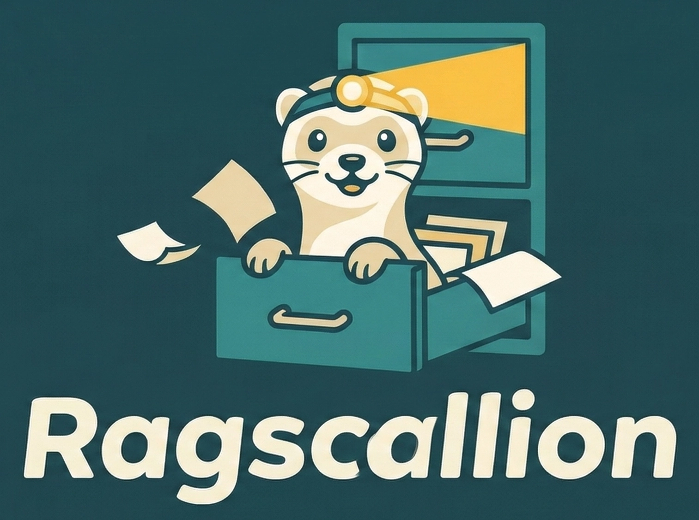

<p align="center">
  <picture>
    <source media="(prefers-color-scheme: dark)" srcset="assets/logo-dark.webp">
    <source media="(prefers-color-scheme: light)" srcset="assets/logo-light.webp">
    
  </picture>
</p>

<p align="center">
  <em>A scrappy, local-first RAG server</em>
</p>

<p align="center">
  
  
  
  
</p>

Drop in PDFs, API docs, scientific papers — anything — and query it over HTTP. No frameworks, no API keys, no cloud.

```
Your coding agent                        Your machine (GPU)
──────────────                            ──────────────────
curl /search?q=...            →           Ragscallion
                                            ├── LanceDB (embedded vector DB)
                              ←             ├── Hybrid search (vector + BM25)
         plain text results                 └── sentence-transformers (GPU)
```

## Why Ragscallion?

Most RAG tools are either **heavyweight frameworks** (LangChain, LlamaIndex) or **tied to one ecosystem** (MCP servers). Ragscallion is:

- **Just HTTP** — any agent that can `curl` can use it. Claude Code, Cursor, Copilot, custom agents, scripts.
- **Hybrid search** — combines semantic vector search with BM25 keyword matching via tantivy, merged with Reciprocal Rank Fusion. Understands meaning *and* finds exact terms.
- **GPU-accelerated** — embeddings run on your GPU. 442 chunks index in ~2 seconds.
- **Zero infrastructure** — no Docker, no cloud, no API keys. Just `uv` and a CUDA GPU.
- **Drop-in documents** — markdown, extracted PDFs (via Marker), API docs, whatever. If it's text, it works.

## How It Compares

| | Ragscallion | [paper-qa](https://github.com/Future-House/paper-qa) | [RAGFlow](https://github.com/infiniflow/ragflow) | [mcp-local-rag](https://github.com/shinpr/mcp-local-rag) | [LangChain RAG](https://github.com/langchain-ai/rag-from-scratch) |
|---|---|---|---|---|---|
| **Setup** | `uv sync` | pip + OpenAI key | Docker Compose | npm + MCP config | pip + API keys |
| **Search** | Hybrid (vector + BM25) | Vector only | Hybrid | Hybrid | Vector only |
| **GPU** | Local CUDA | Cloud API | Optional | CPU only | Cloud API |
| **Interface** | HTTP + CLI | Python API | Web UI | MCP (Claude only) | Python API |
| **Agent-agnostic** | Any agent that can curl | Python only | Browser only | Claude only | Python only |
| **Dependencies** | 7 packages | 20+ | Docker + Elasticsearch + Redis | Node.js + MCP SDK | LangChain ecosystem |
| **API keys needed** | None | OpenAI | Optional | None | OpenAI/other |

**Ragscallion is for you if:**
- You want a coding agent (any agent) to search your local docs
- You don't want to send documents to a cloud API
- You have a CUDA GPU and want fast local embeddings
- You want something you can set up in 5 minutes and forget about

## Quick Start

### Requirements

- Python 3.12+
- [uv](https://docs.astral.sh/uv/) package manager
- NVIDIA GPU with CUDA support

### Install

```bash
git clone https://github.com/ByteBard97/ragscallion.git
cd ragscallion

# Install dependencies (creates .venv automatically)
uv sync
```

### Add documents

Drop markdown files into `docs/`:

```bash
mkdir -p docs
cp your-documents/*.md docs/
```

**Converting PDFs?** Ragscallion works with markdown, so you'll need to convert PDFs first. We recommend [Marker](https://github.com/VikParuchuri/marker) — it's excellent at extracting text from scientific papers and technical docs while preserving structure, tables, and equations. Marker is **not** included in Ragscallion's dependencies because it's a large package with its own model downloads. Install it separately:

```bash
# Install marker as a standalone tool (won't pollute the ragscallion venv)
uv tool install marker-pdf

# Then use the included helper script to convert + ingest in one step
./scripts/add-paper.sh paper.pdf
```

### Ingest

```bash
./rag ingest
```

This embeds all documents and builds both vector and full-text search indexes.

### Search (CLI)

```bash
./rag search "how does negotiated congestion routing work"
./rag search "PathFinder algorithm 3.2" --mode fts
./rag search "port constraints" --mode hybrid -n 3
./rag stats
./rag sources
```

### Search (HTTP server)

```bash
# Start the server
uv run python server.py 8085

# Or install as a systemd service (see below)
```

Query from anywhere on your network (find your IP with `hostname -I` or `ip addr`):

```bash
curl "http://your-machine:8085/search?q=steiner+tree+heuristic&n=5"
curl "http://your-machine:8085/search?q=PathFinder&mode=fts"
curl "http://your-machine:8085/search?q=routing&source=Wybrow2012&mode=hybrid"
curl "http://your-machine:8085/sources"
curl "http://your-machine:8085/stats"
curl "http://your-machine:8085/health"
```

## HTTP API

| Endpoint | Params | Description |
|----------|--------|-------------|
| `GET /search` | `q` (required), `n` (default 5), `source`, `mode` (hybrid/vector/fts) | Search documents |
| `GET /sources` | — | List all indexed documents |
| `GET /stats` | — | Index statistics |
| `GET /health` | — | Health check |

## Search Modes

- **`hybrid`** (default) — runs both vector and full-text search, merges results with RRF reranking. Best for most queries.
- **`vector`** — semantic similarity only. Good for conceptual questions ("how does X work?").
- **`fts`** — keyword matching only. Good for exact terms, names, section references.

## Helper Scripts

### `scripts/rag-query.sh`

A portable shell script for querying from a remote machine (e.g., your laptop running a coding agent):

```bash
# Copy to your laptop, then:
RAG_HOST=192.168.x.x ./scripts/rag-query.sh "your query"
./scripts/rag-query.sh "query" -n 3 -m fts
./scripts/rag-query.sh --sources
./scripts/rag-query.sh --stats
```

### `scripts/add-paper.sh`

Convert PDFs to markdown and ingest in one step:

```bash
./scripts/add-paper.sh paper1.pdf paper2.pdf
```

Requires [Marker](https://github.com/VikParuchuri/marker) (`uv tool install marker-pdf`).

## Running as a Service

To keep the server running (and start on boot):

```bash
# Create systemd user service
mkdir -p ~/.config/systemd/user
cat > ~/.config/systemd/user/ragscallion.service << 'EOF'
[Unit]
Description=Ragscallion Search Server
After=network.target

[Service]
Type=simple
WorkingDirectory=/path/to/ragscallion
ExecStart=/home/YOUR_USER/.local/bin/uv run python server.py 8085
Restart=on-failure
RestartSec=5

[Install]
WantedBy=default.target
EOF

# Edit the paths above, then:
systemctl --user daemon-reload
systemctl --user enable --now ragscallion
```

## How It Works

1. **Ingest** — markdown files are split into overlapping chunks (~1000 chars) preserving section headers and page numbers. Each chunk is embedded using `BAAI/bge-base-en-v1.5` (768-dim) on GPU. Chunks are stored in LanceDB with both vector embeddings and a tantivy full-text index.

2. **Search** — your query is embedded and searched against both indexes. Results are merged using Reciprocal Rank Fusion and returned as plain text with source attribution.

That's it. No chain-of-agents-framework-pipeline-orchestrator.

## Tech Stack

| Component | What | Why |
|-----------|------|-----|
| [LanceDB](https://lancedb.github.io/lancedb/) | Embedded vector DB | No server process, just files on disk |
| [sentence-transformers](https://www.sbert.net/) | Embedding model | Fast GPU inference, good for technical text |
| [tantivy](https://github.com/quickwit-oss/tantivy) | Full-text search | Rust-based BM25, used by LanceDB for FTS index |
| [uv](https://docs.astral.sh/uv/) | Package manager | Fast, reproducible, handles everything |

## License

MIT
